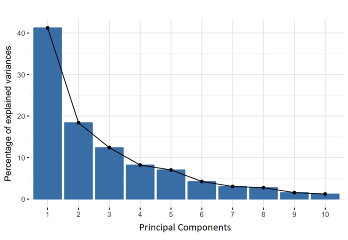

```{r setup, include=FALSE}
library(tufte)
knitr::opts_chunk$set(cache.extra = packageVersion('tufte'), message = FALSE)
options(htmltools.dir.version = FALSE)

```

# Introduction

Principle Component Analysis (PCA) is an unsupervised machine learning ^[Unsupervised machine learning uses machine learning algorithms to analyze and cluster unlabeled datasets. These algorithms discover hidden patterns or data groupings without the need for human intervention.] algorithm which is used for dimensionality reduction in machine learning. It transforms correlated features to linearly uncorrelated features with the help of orthogonal transformation. The newly transformed features are usually known as **Principle Components**. It does this while preserving the maximum amount of information, and enabling representation of multidimensional data. It has wide application such as population, genetics and microbone.

**Dimensionality** is basically the number of columns, attributes/features a data set has, e.g age, sex and so on. Data with large nuber of columns is said to be of high dimensionality which poses a problem when analyzing the data.

**Dimensionality** reduction is the process of reducing the number of random variables (attributes) under consideration and obtaining a set of Principal Components. This can be done due to a variety of reasons e.g;

-   Reduce the complexity of a model

-   Reduce redundancy in the data

-   Lower the chances of model over fitting.

-   Improve the performance of a learning algorithm.

-   Make it easier to visualize the data.

There are several techniques of dimesionality reduction other than PCA which include, but not limited to;

-   Factor Principle Analysis

-   Linear Discriminant Analysis

-   Single value decomposition

An intuitive example of dimensionality reduction can be discussed through a simple e-mail classification problem, where we need to classify whether the e-mail is spam or not. This can involve a large number of features, such as whether or not the e-mail has a generic title, the content of the e-mail, whether the e-mail uses a template, etc. However, some of these features may overlap. In another condition, a classification problem that relies on both humidity and rainfall can be collapsed into just one underlying feature, since both of the aforementioned are correlated to a high degree. Hence, we can reduce the number of features in such problems.

## Components of Dimesionality Reduction

There are two components of dimenionality reduction as discussed below;

## 1. Feature Selection

In this method, we try to find a smaller subset of the variables or features to get a smaller data set which can be used to model the problem. It can be done in three ways;

1.  Filter

2.  Wrapper

3.  Embedded

## 2. Feature Extraction

This is reducing a high dimesional space into a lower dimensional space.That is, space with lower dimensional.

Dimensionality reduction can be non - linear or linear depending on the method used. However, as mentioned earlier, PCA uses linear methods. PCA is explained in steps as follows;

## Step 1: Standardization

The aim of this step is to standardize the range of the continuous initial variables so that each one of them contributes equally to the analysis. More specifically, the reason why it is critical to perform standardization prior to PCA, is that the latter is quite sensitive regarding the variances of the initial variables. That is, if there are large differences between the ranges of initial variables, those variables with larger ranges will dominate over those with small ranges (for example, a variable that ranges between 0 and 100 will dominate over a variable that ranges between 0 and 1), which will lead to biased results. So, transforming the data to comparable scales can prevent this problem.

Mathematically, this can be done by subtracting the mean and dividing by the standard deviation for each value of each variable.

```{marginfigure}
$$z = \frac{value - mean}{Standard\space Deviation}$$
```

## Step 2 : Covariance Matrix Computation

The aim of this step is to understand how the variables of the input data set are varying from the mean with respect to each other, or in other words, to see if there is any relationship between them. Because sometimes, variables are highly correlated in such a way that they contain redundant information. So, in order to identify these correlations, we compute the covariance matrix.

The covariance matrix is a p × p symmetric matrix (where p is the number of dimensions) that has as entries the covariances associated with all possible pairs of the initial variables. For example, for a 3-dimensional data set with 3 variables x, y, and z, the covariance matrix is a 3×3 matrix of this from:

```{marginfigure}
$$\begin{bmatrix}cov(x,x)&cov(x,y) &cox(x,z)\\cov(y,x)&cov(y,y)&cov(y,z)\\cov(z,x)&cov(z,y)&cov(z,z)\end{bmatrix}
$$
```

Since the covariance of a variable with itself is its variance (Cov(a,a)=Var(a)), in the main diagonal (Top left to bottom right) we actually have the variances of each initial variable. And since the covariance is commutative (Cov(a,b)=Cov(b,a)), the entries of the covariance matrix are symmetric with respect to the main diagonal, which means that the upper and the lower triangular portions are equal.

If positive then: the two variables increase or decrease together (correlated) If negative then: one increases when the other decreases (Inversely correlated). Now that we know that the covariance matrix is not more than a table that summarizes the correlations between all the po mssible pairs of variables, let's move to the next step.

## Step 4 : Compute the Eigenvalues and Eigenvectors of the covariance matrix.

This is done to identify the principle components.

Eigenvectors and eigenvalues are the linear algebra concepts that we need to compute from the covariance matrix in order to determine the principal components of the data. Before getting to the explanation of these concepts, let's first understand what do we mean by principal components.

Principal components are new variables that are constructed as linear combinations or mixtures of the initial variables. These combinations are done in s l.;/.uch a way that the new variables (i.e., principal components) are uncorrelated and most of the information within the initial variables is squeezed or compressed into the first components. So, the idea is 10-dimensional data gives you 10 principal components, but PCA tries to put maximum possible information in the first component, then maximum remaining information in the second and so on, until having something like shown in the scree plot below.

```{marginfigure}

```

Geometrically speaking, principal components represent the directions of the data that explain a maximal amount of variance, that is to say, the lines that capture most information of the data. The relationship between variance and information here, is that, the larger the variance carried by a line, the larger the dispersion of the data points along it, and the larger the dispersion along a line, the more information it has. To put all this simply, just think of principal components as new axes that provide the best angle to see and evaluate the data, so that the differences between the observations are better visible.

## How does Principle Component Work

As there are as many principal components as there are variables in the data, principal components are constructed in such a manner that the first principal component accounts for the largest possible variance in the data set. Mathematically speaking, it’s the line that maximizes the variance (the average of the squared distances from the projected points (red dots) to the origin).

The second principal component is calculated in the same way, with the condition that it is uncorrelated with (i.e., perpendicular to) the first principal component and that it accounts for the next highest variance.

This continues until a total of p principal components have been calculated, equal to the original number of variables.

Now that we understand what we mean by principal components, let’s go back to eigenvectors and eigenvalues. What you first need to know about them is that they always come in pairs, so that every eigenvector has an eigenvalue. And their number is equal to the number of dimensions of the data. For example, for a 3-dimensional data set, there are 3 variables, therefore there are 3 eigenvectors with 3 corresponding eigenvalues.

Without further ado, it is eigenvectors and eigenvalues who are behind all the magic explained above, because the eigenvectors of the Covariance matrix are actually the directions of the axes where there is the most variance(most information) and that we call Principal Components. And eigenvalues are simply the coefficients attached to eigenvectors, which give the amount of variance carried in each Principal Component.

But how do we calculate the Eigenvectors and Eigenvalues?

Let A be a square matrix, then the eigenvalues of A are the values of $\lambda$ satisfying the equation;

$$|A-\lambda I|$$

Where $I$ is the identity matrix. For example, suppose that the matrix A is defined as;

$$A = \begin{bmatrix}2&!\\1&2 \end{bmatrix}$$

Then,

$$\begin{bmatrix}2-\lambda&!\\1&2-\lambda\end{bmatrix}$$

Then finding the determinant of the above matrix and equating the resulting polynomial to zero we thus obtain the equation;

$$\lambda^2-4\lambda+3=0$$

After solving the above equation, we obtain two values of $\lambda$ as 1 and 2. These are the eigenvalues of the matrix A.

To obtain the eigenvectors corresponding to the eigenvalues, we solve the equation;

$AV = \lambda V$ = $(A-\lambda)v=0$

So the eigenvectors for the eigenvalue 1 is obtained as follows;

$\left(\begin{bmatrix}2-\lambda&1\\1&2-\lambda \end{bmatrix}\right)v = 0$

This simplifies to;

$$\left(\begin{bmatrix}1&1\\1&1 \end{bmatrix}\right )\times\begin{bmatrix}v_{11}\\v_{12} \end{bmatrix}=0$$

The above gives the following two equations;

$v_{11}-v_{12}=0$ and $v_{12}-v_{11}=0$ , This implies that 
$v_{11}=-v_{12}$, which implies that the eigenvector for the eigenvalue 1 is $\begin{bmatrix}1\\-1 \end{bmatrix}$. And the eigenvector for the second eigen value is obtain in the similar way.

By ranking your eigenvectors in order of their eigenvalues, highest to lowest, you get the principal components in order of significance.


Without further ado, it is eigenvectors and eigenvalues who are behind all the magic explained above, because the eigenvectors of the Covariance matrix are actually the directions of the axes where there is the most variance(most information) and that we call Principal Components. And eigenvalues are simply the coefficients attached to eigenvectors, which give the amount of variance carried in each Principal Component.

By ranking your eigenvectors in order of their eigenvalues, highest to lowest, you get the principal components in order of significance.

Let’s suppose that our data set is 2-dimensional with 2 variables x,y and that the eigenvectors and eigenvalues of the covariance matrix are as follows:

$v_1 = \begin{bmatrix} 0.6778736 \\0. 7351785 \end{bmatrix}$ and $\lambda_1 = 1.284028$, and ;

$v_2 = \begin{bmatrix} -0. 7351785 \\ 0.6778736\end{bmatrix}$ and $\lambda_1 = 0.04908323$

If we rank the eigenvalues in descending order, we get $\lambda_1>\lambda_2$, which means that the eigenvector that corresponds to the first principal component (PC1) is v1 and the one that corresponds to the second component (PC2) is v2.

After having the principal components, to compute the percentage of variance (information) accounted for by each component, we divide the eigenvalue of each component by the sum of eigenvalues. If we apply this on the example above, we find that PC1 and PC2 carry respectively 96% and 4% of the variance of the data.

## Step 4 : Feature Selection

As we saw in the previous step, computing the eigenvectors and ordering them by their eigenvalues in descending order, allow us to find the principal components in order of significance. In this step, what we do is, to choose whether to keep all these components or discard those of lesser significance (of low eigenvalues), and form with the remaining ones a matrix of vectors that we call Feature vector.

So, the feature vector is simply a matrix that has as columns the eigenvectors of the components that we decide to keep. This makes it the first step towards dimensionality reduction, because if we choose to keep only p eigenvectors (components) out of n, the final data set will have only p dimensions.

Continuing with the example from the previous step, we can either form a feature vector with both of the eigenvectors v1 and v2:

$$\begin{bmatrix}0.6778736 & -0. 7351785\\
0.7351785&0.6778736\end{bmatrix}$$

Or discard the eigenvector v2, which is the one of lesser significance, and form a feature vector with v1 only:

$$\begin{bmatrix}0.6778736 \\0.7351785\end{bmatrix}$$

Discarding the eigenvector v2 will reduce dimensionality by 1, and will consequently cause a loss of information in the final data set. But given that v2 was carrying only 4% of the information, the loss will be therefore not important and we will still have 96% of the information that is carried by v1.

So, as we saw in the example, it’s up to you to choose whether to keep all the components or discard the ones of lesser significance, depending on what you are looking for. Because if you just want to describe your data in terms of new variables (principal components) that are uncorrelated without seeking to reduce dimensionality, leaving out lesser significant components is not needed.

## Last Step : Recast the Data Along the Principal Component Axes

In the previous steps, apart from standardization, you do not make any changes on the data, you just select the principal components and form the feature vector, but the input data set remains always in terms of the original axes (i.e, in terms of the initial variables).

In this step, which is the last one, the aim is to use the feature vector formed using the eigenvectors of the covariance matrix, to reorient the data from the original axes to the ones represented by the principal components (hence the name Principal Components Analysis). This can be done by multiplying the transpose of the original data set by the transpose of the feature vector.

```{figmargin}
$$FinalDataset = FeatureVector^T \times StandardizedOriginalDataset^T$$
```

PCA works best for numerical data. To demonstrate this, let's do this for the mtcars data set, as follows;

```{r}
data("mtcars")
knitr:: kable(head(mtcars), format = "latex",booktabs = TRUE)
```


As I have mentioned above, the PCA does not work well for categorical data thus let's eliminate vs and am as follows;

```{r}
mtcars2 <- mtcars |>
  dplyr::select(,-c("vs", "am"))
```

Thus the data is;

```{r}
knitr::kable(head(mtcars2), format = "latex", booktabs = TRUE)
```

All variables in our data set are continuous variables hence we can proceed with the PCA. In R, PCA is done using the base function **prcomp()** as follows;

```{r}
mtcars.pc <- prcomp(mtcars2, center = TRUE, scale. = TRUE)
```

The scale function is used for normalization. Then the Principal Components are;

```{r}
summary(mtcars.pc)
```

Thus as can be seen above, our PC1 holds 62.84% of the information and PC2 IS 23.13% all the way to PC9. These are the Principal Components.

## Plotting the PCA

To plot the PCA, we need the package ggbiplot which will helps us to plot the biplot which includes both the position of each sample in terms of PC1 and PC2 and also will show us how the initial variables map onto this. . A biplot is a type of plot that will allow you to visualize how the samples relate to one another in our PCA (which samples are similar and which are different) and will simultaneously reveal how each variable contributes to each principal component.

```{r, , fig.margin = TRUE, fig.cap="A biplot of the principle component analysis",  fig.width=4.5, fig.height=4.5, cache=TRUE, message=FALSE}
library(ggbiplot)
ggbiplot(mtcars.pc)
```

The axes are seen as arrows originating from the center point. Here, you see that the variables hp, cyl, and disp all contribute to PC1, with higher values in those variables moving the samples to the right on this plot. This lets you see how the data points relate to the axes, but it's not very informative without knowing which point corresponds to which sample (car).

You'll provide an argument to ggbiplot: let's give it the rownames of mtcars as labels. This will name each point with the name of the car in question:

ggbiplot(mtcars.pca, labels=rownames(mtcars))

```{r, , fig.margin = TRUE, fig.width=4.5, fig.height=4.5, cache=TRUE, message=FALSE}
ggbiplot(mtcars.pc, labels=rownames(mtcars2))
```

Now you can see which cars are similar to one another. For example, the Maserati Bora, Ferrari Dino and Ford Pant era L all cluster together at the top. This makes sense, as all of these are sports cars.

# Correspondence Analysis (CA)

CA is an extension of PCA which is used to examine relationship betweem qualitative (Categorical) variables. It is traditionaly applied for dimensionality reduction in contigency tables. When analyzing a two-way contingency table, a typical question is whether certain row elements are associated with some elements of column elements. Correspondence analysis is a geometric approach for visualizing the rows and columns of a two-way contingency table as points in a low-dimensional space, such that the positions of the row and column points are consistent with their associations in the table. The aim is to have a global view of the data that is useful for interpretation. In the current chapter, we’ll show how to compute and interpret correspondence analysis using two R packages: i) **FactoMineR** for the analysis and ii) **factoextra** for data visualization. Additionally, we’ll show how to reveal the most important variables that explain the variations in a data set. We continue by explaining how to apply correspondence analysis using supplementary rows and columns. This is important, if you want to make predictions with CA. The last sections of this guide describe also how to filter CA result in order to keep only the most contributing variables. Finally, we’ll see how to deal with outliers.


let's load the packages

```{r}
library("FactoMineR")
library("factoextra")
```

The data should be a contingency table. We’ll use the demo data sets housetasks available in the factoextra R package.

```{r}
data("housetasks")
knitr::kable(housetasks, format = "latex", booktabs = TRUE)
```


The data is a contingency table containing 13 housetasks and their repartition in the couple: rows are the different tasks values are the frequencies of the tasks done :
- by the wife only

- alternatively

- by the husband only

- or jointly

The above contingency table is not very large. Therefore, it’s easy to visually inspect and interpret row and column profiles:

It’s evident that, the housetasks 

- Laundry, Main_Meal and Dinner are more frequently done by the “Wife”.

- Repairs and driving are dominantly done by the husband

- Holidays are frequently associated with the column “jointly”

Briefly, contingency table can be visualized using the functions *balloonplot()* from **gplots package** and *mosaicplot()* from **garphics package**

```{r, , fig.margin = TRUE,  fig.width=4.5, fig.height=4.5, cache=TRUE, message=FALSE}
library(gplots)
# 1. convert the data as a table
dt <- as.table(as.matrix(housetasks))
# 2. Graph
balloonplot(t(dt), main ="housetasks", xlab ="", ylab="",
            label = FALSE, show.margins = FALSE)

```

After the visualization, we can now conduct CA analysis as follows;

```{r}
library("FactoMineR")
res.ca <- CA(housetasks, graph = FALSE)
```

To identify which variables have high amount of information, we can use the spree plot which can be constructed using the function *fvix_eg()* in the **factoextra** package, as follows;
 
```{r, , fig.margin = TRUE, fig.width=3.5, fig.height=3.5, cache=TRUE, message=FALSE }
library(factoextra)
fviz_eig(res.ca, addlabels = TRUE, ylim = c(0,50))

```
 

^[The point at which the scree plot shows a bend (so called “elbow”) can be considered as indicating an optimal dimensionality.]
It’s also possible to calculate an average eigenvalue above which the axis should be kept in the solution. Our data contains 13 rows and 4 columns.

- If the data were random, the expected value of the eigenvalue for each axis would be 1/(nrow(housetasks)-1) = 1/12 = 8.33% in terms of rows.

- Likewise, the average axis should account for 1/(ncol(housetasks)-1) = 1/3 = 33.33% in terms of the 4 columns.

According to (M. T. Bendixen 1995):

Any axis with a contribution larger than the maximum of these two percentages should be considered as important and included in the solution for the interpretation of the data.

The R code below, draws the scree plot with a red dashed line specifying the average eigenvalue:

```{r, , fig.margin =TRUE, fig.width=3.5, fig.height=3.5, cache=TRUE, message=FALSE}
library(ggplot2)
fviz_screeplot(res.ca) +
 geom_hline(yintercept=33.33, linetype=2, color="red")
```

According to the graph above, only dimensions 1 and 2 should be used in the solution. The dimension 3 explains only 11.4% of the total inertia which is below the average eigeinvalue (33.33%) and too little to be kept for further analysis.

The function *fviz_ca_biplot() * from **factoextra package** can be used to draw the biplot of rows and columns variables.

```{r, , fig.margin =TRUE, fig.width=4.5, fig.height=4.5, cache=TRUE, message=FALSE}
fviz_ca_biplot(res.ca, repel = TRUE)
```

The biplot shows that housetasks suchas Driving, repairs and official are done by the husband while houstasks such as Laundry, breakfast , main meal and Dinner are done by the wife. Also, housetasks such as Finances and Insurances are done jointly.

The function get_ca_col() [in factoextra] is used to extract the results for column variables. This function returns a list containing the coordinates, the cos2, the contribution and the inertia of columns variables:

```{r}
col <- get_ca_col(res.ca)

```


# Multiple correspondence analysis (MCA) 

Previously, we described how to compute and interpret the simple correspondence analysis. In the current chapter, we demonstrate how to compute and visualize multiple correspondence analysis in R software using FactoMineR (for the analysis) and factoextra (for data visualization). Additionally, we’ll show how to reveal the most important variables that contribute the most in explaining the variations in the data set. We continue by explaining how to predict the results for supplementary individuals and variables. Finally, we’ll demonstrate how to filter MCA results in order to keep only the most contributing variables. MCA is generally used to analyse a data set from survey. The goal is to identify:

- A group of individuals with similar profile in their answers to the questions

- The associations between variable categories

We’ll use the demo data sets poison available in FactoMineR package:

```{r}
data("poison")
knitr::kable(head(poison[,1:5]),format = "latex",booktabs = TRUE)
```


This data is a result from a survey carried out on children of primary school who suffered from food poisoning. They were asked about their symptoms and about what they ate.

The data contains 55 rows (individuals) and 15 columns (variables). We’ll use only some of these individuals (children) and variables to perform the multiple correspondence analysis. The coordinates of the remaining individuals and variables on the factor map will be predicted from the previous MCA results.

Subset only active individuals and variables for multiple correspondence analysis:

```{r}
poison.active <- poison[1:55, 5:15]
knitr::kable(head(poison.active[, 1:6], 3), format = "latex",booktabs = TRUE)
```


It’s also possible to plot the frequency of variable categories. The R code below, plots the first 4 columns:

```{r, , fig.margin =TRUE, fig.width=3.5, fig.height=3.5, cache=TRUE, message=FALSE}
for (i in 1:4) {
  plot(poison.active[,i], main=colnames(poison.active)[i],
       ylab = "Count", col="steelblue", las = 2)
  }
```

We can thus conduct MCA as follows;

```{r}
res.mca <- MCA(poison.active, graph = FALSE)
```

Let's visualize the percentages of inertia explained by each MCA dimensions,

```{r, , fig.margin =TRUE, fig.width=3.5, fig.height=3.5, cache=TRUE, message=FALSE}
fviz_screeplot(res.mca, addlabels = TRUE, ylim = c(0,40))
```

The R code below displays the coordinates of each variable categories in each dimension (1, 2 and 3):

```{r}
var <- get_mca_var(res.mca)
knitr::kable(head(round(var$coord, 2), 4), format = "latex",booktabs = TRUE)
```

# Factor analysis of mixed data (FAMD)

Factor analysis of mixed data (FAMD) is a principal component method dedicated to analyze a data set containing both quantitative and qualitative variables. t makes it possible to analyze the similarity between individuals by taking into account a mixed types of variables. Additionally, one can explore the association between all variables, both quantitative and qualitative variables.
It can be seen as a combination of PCA and MCA.

We’ll use a subset of the wine data set available in FactoMineR package:

```{r}
data("wine")

# Subsetting the required columns
df <- wine[,c(1,2, 16, 22, 29, 28, 30,31)]
knitr::kable(head(df[, 1:7], 4), format = "latex", booktabs = TRUE)
```


The data contains 21 rows (wine, individuals) and 8 columns (attributes). The first two columns are categorical, that is label and Soil while the rest are numerical.
The function *FAMD()* from **FactoMiner package** can be used to compute FAMD. A simplified format is :

*FAMD (base, ncp = 5, sup.var = NULL, ind.sup = NULL, graph = TRUE)*

- **base** : a data frame with n rows (individuals) and p columns (variables).

- **ncp** : the number of dimensions kept in the results (by default 5)

- **sup.var** : a vector indicating the indexes of the supplementary variables.

- **ind.sup** : a vector indicating the indexes of the supplementary                           individuals.

- **graph** : a logical value. If TRUE a graph is displayed.

```{r}
library(FactoMineR)
res.famd <- FAMD(df, graph = FALSE)
```

We’ll use the following factoextra functions:

- *get_eigenvalue(res.famd)*: Extract the eigenvalues/variances retained by each dimension (axis).

- *fviz_eig(res.famd)*: Visualize the eigenvalues/variances.

- *get_famd_ind(res.famd)*: Extract the results for individuals.

- *get_famd_var(res.famd)*: Extract the results for quantitative and qualitative variables.

- *fviz_famd_ind(res.famd)*, *fviz_famd_var(res.famd)* : Visualize the results for individuals and variables, respectively.


```{r, fig.margin =TRUE, fig.width=3.5, fig.height=3.5, cache=TRUE, message=FALSE}
fviz_screeplot(res.famd, addlabels = T, ylim = c(0, 50))
```

Then 

```{r, fig.margin =TRUE, fig.width=3.5, fig.height=3.5, cache=TRUE, message=FALSE}
# Plot of variables
fviz_famd_var(res.famd, repel = TRUE)
# Contribution to the first dimension
fviz_contrib(res.famd, "var", axes = 1)
# Contribution to the second dimension
fviz_contrib(res.famd, "var", axes = 2)
```

The red dashed line on the graph above indicates the expected average value, If the contributions were uniform.


